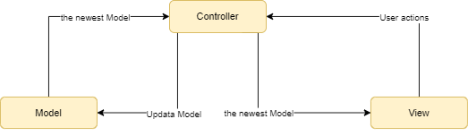

**Architectural Representation**

This project uses the MVC Pattern for the front end (React Native written in JS) and for the back end (Python Flask). So the model (data), the view (user interface) and the controller (controls of the data flows) are separated. The MVC Pattern can be seen in the next picture:

